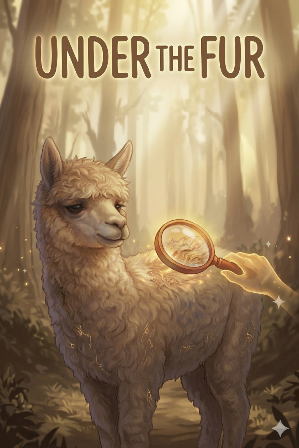
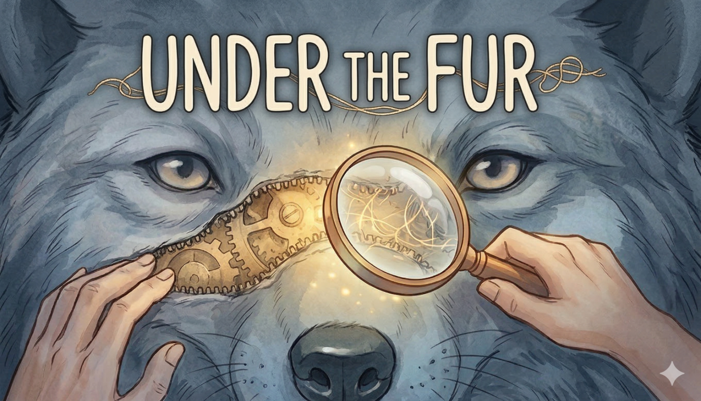
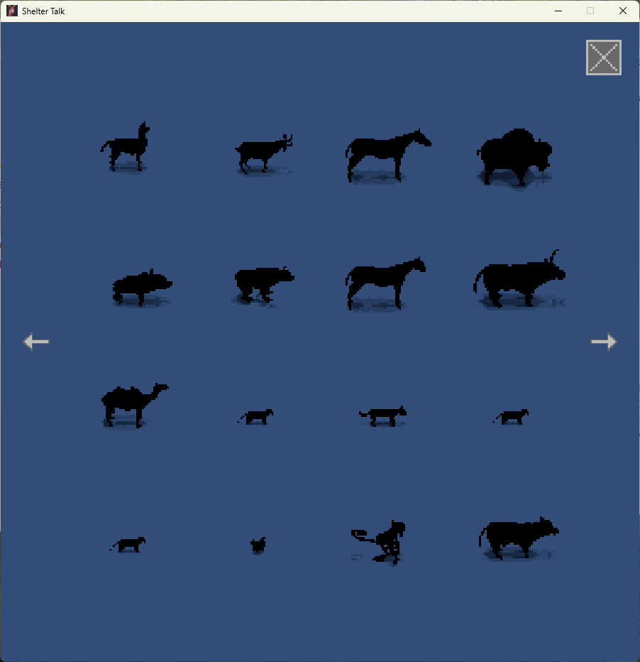
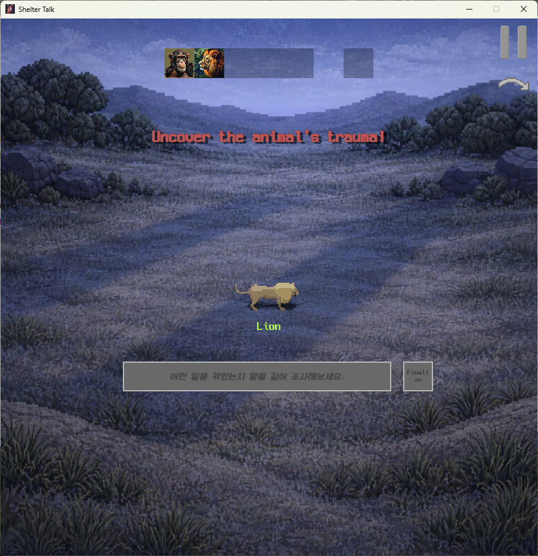
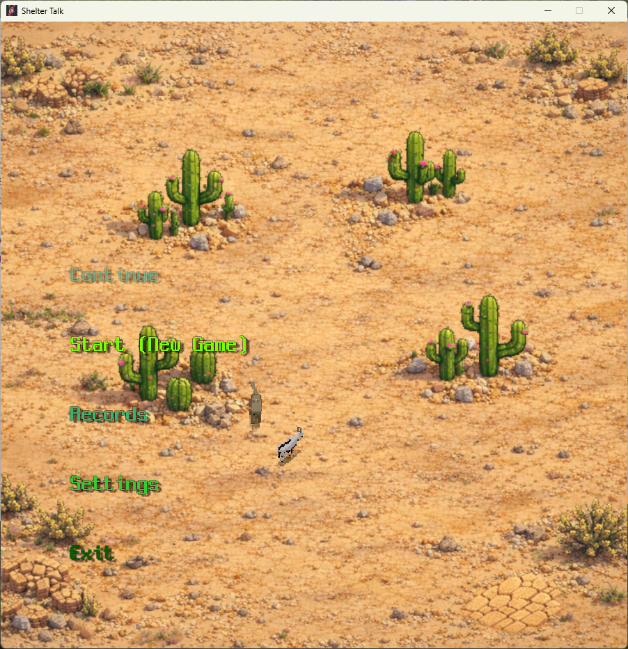

# Under the Fur

Under the Fur는 플레이어가 보호소의 동물들과 대화하며, 각 동물이 숨기고 있는 트라우마를 파악해 나가는 AI 기반 대화형 게임입니다.  
단순한 선택지가 아닌 직접 입력한 문장을 통해 동물들과 소통하고, 대화 속 단서들을 바탕으로 진실에 가까워지는 경험을 제공합니다.

## 프로젝트 소개

플레이어는 동물 보호소 직원이 되어 여러 동물들과 대화를 나누게 됩니다.  
각 동물은 저마다의 성격, 감정, 과거의 상처를 가지고 있으며, 플레이어는 대화를 통해 그들의 마음을 열고 트라우마를 밝혀내야 합니다.

이 게임은 정답을 빠르게 맞히는 방식보다, 대화의 흐름을 읽고 상대의 반응을 이해하는 과정 자체에 집중합니다.

## 주요 특징

- AI 기반 자유 입력 대화 시스템
- 각 동물마다 다른 성격과 반응 구조
- 대화 내용을 바탕으로 트라우마를 추론하는 게임 진행
- 플레이어의 표현 방식에 따라 달라지는 상호작용
- 감정적 몰입을 중심으로 한 내러티브 경험

## 핵심 시스템

### 1. 자유 입력 대화
플레이어는 정해진 선택지가 아니라 직접 문장을 입력하여 동물과 대화합니다.  
이를 통해 보다 자연스럽고 몰입감 있는 상호작용을 구현했습니다.

### 2. 트라우마 추론
대화 중 얻은 정보와 반응을 바탕으로, 플레이어는 각 동물의 트라우마를 추측할 수 있습니다.  
정확한 이해 없이 성급하게 판단하면 실패할 수 있으며, 충분한 대화와 관찰이 중요합니다.

### 3. AI 응답 구조
동물들은 단순한 반복 대사가 아니라, 성격과 상황에 맞는 반응을 생성합니다.  
이를 통해 매 대화가 보다 유기적으로 느껴지도록 설계했습니다.

### 4. 세션 진행 방식
게임은 여러 날에 걸쳐 진행되며, 플레이어는 하루에 한 동물과 대화하면서 목표를 달성해야 합니다.  
누적 성공 횟수에 따라 전체 진행 결과가 달라집니다.

## 기술 스택

- Unity
- C#
- OpenAI API
- JSON 기반 응답 처리
- UI 중심 대화 인터랙션 시스템

## 개발 목표

Under the Fur는 단순히 정보를 얻는 대화 게임이 아니라,  
플레이어가 상대의 감정과 상처를 이해하는 과정을 게임플레이로 표현하는 것을 목표로 합니다.

또한 AI를 활용해 기존의 고정형 대사 구조를 넘어,  
더 자연스럽고 살아 있는 캐릭터 반응을 구현하는 것을 핵심 방향으로 삼고 있습니다.

## 향후 계획

- 동물별 개별 스토리 강화
- UI/UX 개선
- 플레이 흐름 및 몰입감 강화
- Steam 배포

## 스크린샷

## 실행 환경

- Unity 프로젝트
- OpenAI API Key 필요
- PC 환경 기준 개발

## 프로젝트 상태

데모 출시 준비중
